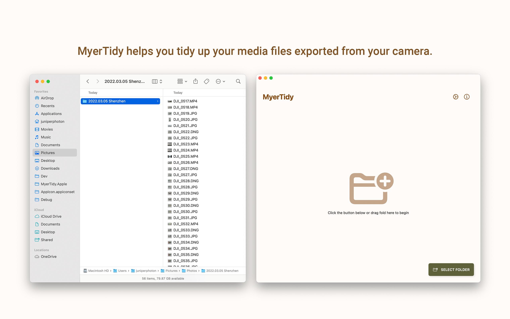
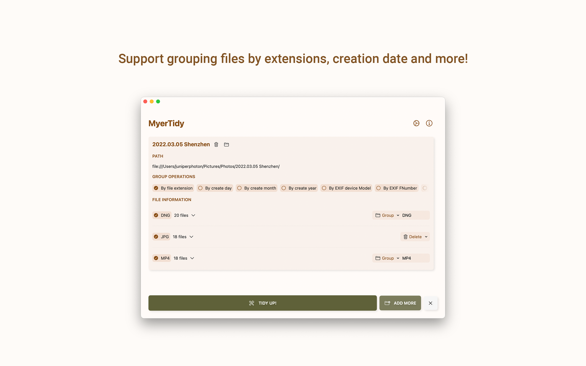
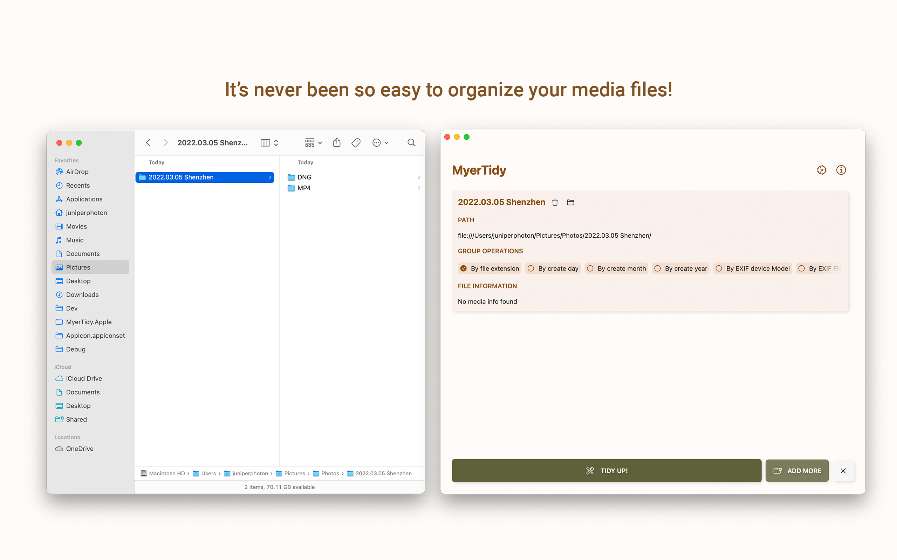

# MyerTidy.Apple

It’s never been so easy to organize your media files exported from cameras. With just simple clicks, you can group or delete your media files by file extensions, creation date, camera model or more.

## Features

### Helps you organize your media files from camera

If you pull download all media files from camera, like Sony A7 series or DJI Mavic series, different files are mixed in one folder and it's no easy to separate them.

## Support multi grouping schemes

By dragging folders (Yes, multi folders supported) into MyerTidy app, you can select grouping schemes by file extensions, creation date and more.

Creating your own custom grouping scheme will be supported in the future.

## Easy to use

The screenshot below shows the result of the previous process.

## Development roadmap

- [x] 1.0 Support
- [x] Support running on macOS, iPadOS and iOS
- [x] Support drag & drop from Finder
- [x] Tailor UI for iPhone
- [ ] Support custom grouping scheme
- [ ] Support chaining process

## License
The project is released under MIT License.

MIT License

Copyright (c) 2020 JuniperPhoton

Permission is hereby granted, free of charge, to any person obtaining a copy of this software and associated documentation files (the "Software"), to deal in the Software without restriction, including without limitation the rights to use, copy, modify, merge, publish, distribute, sublicense, and/or sell copies of the Software, and to permit persons to whom the Software is furnished to do so, subject to the following conditions:

The above copyright notice and this permission notice shall be included in all copies or substantial portions of the Software.

THE SOFTWARE IS PROVIDED "AS IS", WITHOUT WARRANTY OF ANY KIND, EXPRESS OR IMPLIED, INCLUDING BUT NOT LIMITED TO THE WARRANTIES OF MERCHANTABILITY, FITNESS FOR A PARTICULAR PURPOSE AND NONINFRINGEMENT. IN NO EVENT SHALL THE AUTHORS OR COPYRIGHT HOLDERS BE LIABLE FOR ANY CLAIM, DAMAGES OR OTHER LIABILITY, WHETHER IN AN ACTION OF CONTRACT, TORT OR OTHERWISE, ARISING FROM, OUT OF OR IN CONNECTION WITH THE SOFTWARE OR THE USE OR OTHER DEALINGS IN THE SOFTWARE.
